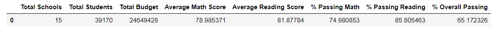
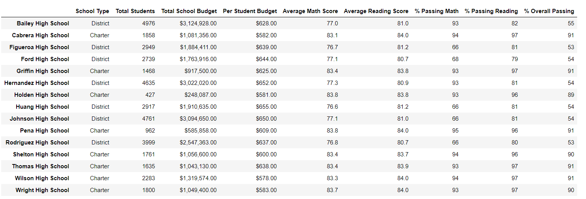

# School_District_Analysis

## Overview
The school board beginning the budget discussions for the upcoming school year.  They would like to understand how standardized testing relates to funding at the school and student levels to assist in the budgeting process.

This analysis should be able to assist the school board in understanding math/reading standardized test scores and how they relate to spending and if there are any correlations in performance and the amount spent per student.  We are also looking to see if there are any performance trend or patterns impacted by spend.
 
We reviewed the student’s scores and budgets at the following levels:
1.	Math and reading
2.	School 
3.	School and school type (charter vs. district)
4.	District 

This analysis will assist the school board and superintendent in making decisions around school budgets and priorities.

There has been evidence of academic dishonesty; specifically, reading and math grades for Thomas High School (THS) ninth graders as they appear to have been altered.   Although the school board does not know the full extent of the academic dishonesty, they want to uphold state-testing standards, therefore, the test results from this population have been excluded from the analysis.  We will attempt to understand how the changes to THS impact the results and analysis.

## Results
As a whole, the overall impact of removing 9th grade from the dataset was minimal.  The average math/reading scores remained flat while the percentage of students passing declined by 0.2% and 0.1%, respectively. The overall passing moved the most at 0.3%.

•The only impact at the school level was to THS with the exclusion of 9th grade.
•THS is in the 630-644 spending range per student, which has poorer scores than two of the other three spending ranges.  However, THS has the highest scores of the four schools in this range.  Because the score movement was less than half a percent, there was no impact to the overall scores for spending.
•THS is in the medium range for school size (1,000 to 2,000 students) with 1,635 students.  The scores before and after adjustments were relatively the same and had no impact on scores based on school size.
•When looking at the type of school (charter vs. district), the adjustments to THS only impacted the scores for charter schools, but again, the impact was minimal.

## Summary

	

The district spent an average of $629 per student across 15 schools.  Overall the students passed the reading and math testing at a rate of 64.9% with reading out performing math.  One thing to note is that the more the school spends per student the worse the overall scores are as a group.

•The bottom half of the schools in relation to performance spent an average of $2.5mm and had an average score of 54.  These are some of the larger schools with an average per student of $644, which is $50 higher than the top performing schools. 
•Charter schools also spent less per student than district schools with better results.

Finally, the impact of removing the data for 9th grade students was minimal and do not impact the overall results of the testing.  The school board would be able to look at results from either scenario to make their decisions in regards to funding.  

It is recommended to do a little more research into the schools to see if there are other forces that are impacting scores such factors as parent involvement, socioeconomics, teacher experience and pay scales just to name a few.